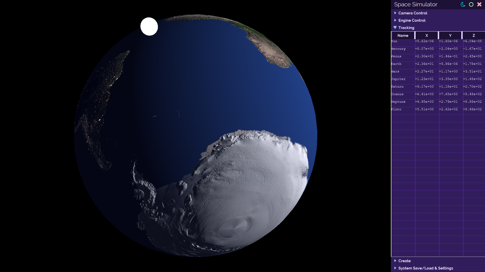
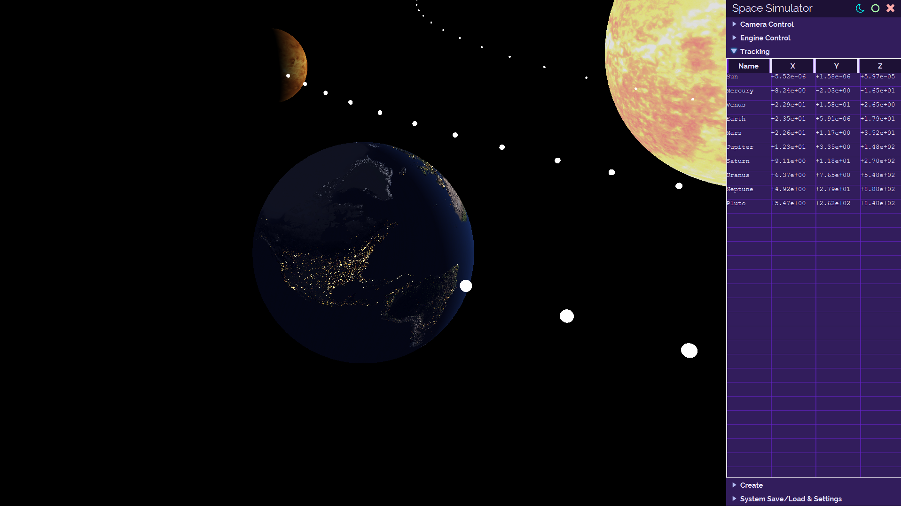
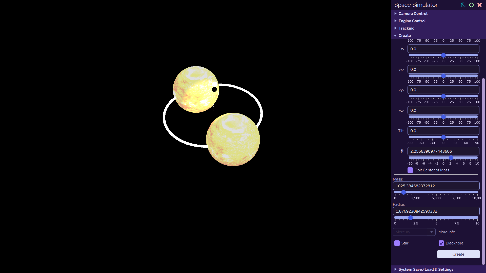

# Space

Space Simulation.

- 3D N-body newtonian gravity
- Lighting & Shadows
  - Light emitters (stars)
- Different body types
- JavaFX
- Runs great on old intel mac but lags a lot on beafy windows for some reason.
- i18n
- 8K normal and specular map of earth

## Demo

